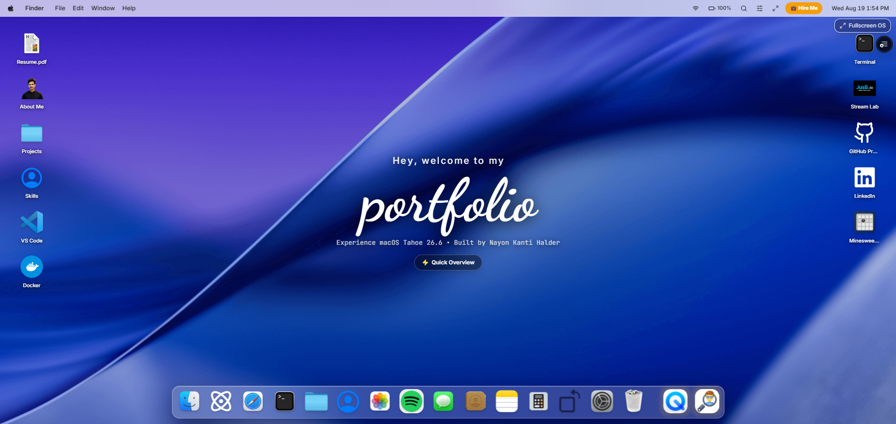
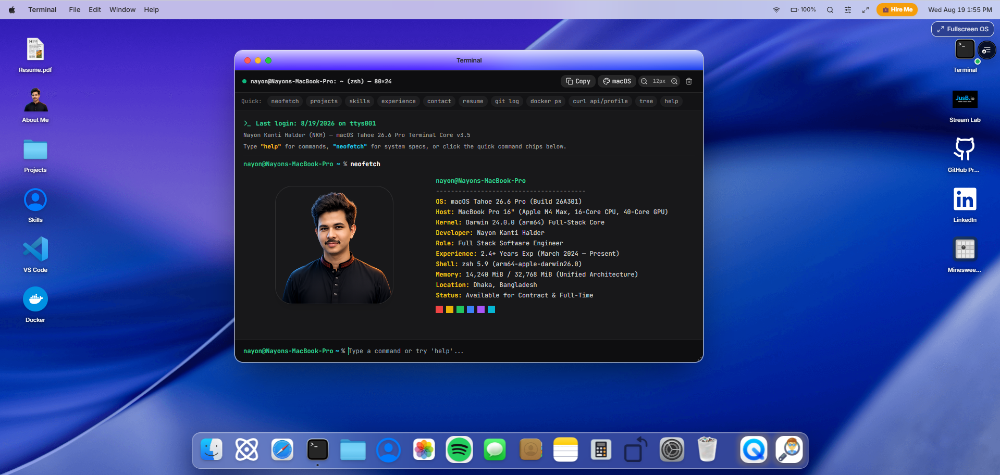
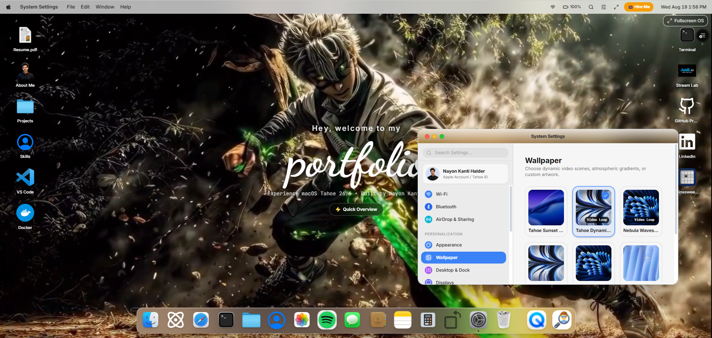

<div align="center">

#  macOS Desktop Portfolio Experience

### *A Pixel-Perfect, High-Performance macOS Operating System in the Browser*

[](https://nayon-halder-os.vercel.app)
[](https://github.com/nrbnayon/macOS-portfolio-overview)
[](LICENSE)

<br />

[](https://nextjs.org/)
[](https://react.dev/)
[](https://www.typescriptlang.org/)
[](https://tailwindcss.com/)
[](https://www.framer.com/motion/)
[](https://www.mongodb.com/)
[](https://groq.com/)

<p align="center">
  <b>Built for Software Engineers, Recruiters, and macOS Lovers.</b><br>
  Explore an authentic desktop interface featuring multi-window layering, physics-driven magnification Dock, Spotlight search, native apps, live REST APIs, and an AI chat assistant.
</p>

[🖥️ View Live Demo](https://nayon-halder-os.vercel.app) • [🚀 Report Bug](https://github.com/nrbnayon/macOS-portfolio-overview/issues) • [✨ Request Feature](https://github.com/nrbnayon/macOS-portfolio-overview/issues)

</div>

---

## 📸 Desktop Visual Overview

<div align="center">
  
  <p><em>Figure 1: Full macOS Desktop Interface with Live Multi-Window Layering & Floating Magnification Dock.</em></p>
</div>

<br />

<div align="center">
  
  <p><em>Figure 2: Interactive Dynamic Applications — Projects.app, Spotlight Search (`⌘ + Space`), and Terminal.app.</em></p>
</div>

<br />

<div align="center">
  
  <p><em>Figure 3: HireMe.app Executive Recruiter Hub with MailApp Integration & 1-Click Inquiry Templates.</em></p>
</div>

---

## 🌟 Architectural Highlights

### 🖥️ 1. True Multi-Window Desktop Engine
- **Z-Index Elevation**: Authentic window stacking order with automatic foreground focus when clicked or activated from the Dock.
- **Physics-Based Window Management**: Smooth draggable headers, 8-direction resizable handles, and viewport boundary constraints.
- **macOS Traffic Lights**: Fully functional `Close`, `Minimize` (with restore indicators), and `Fullscreen / Zoom` toggles.
- **Contextual Menubar Sync**: Dynamically synchronizes the top system menu bar (`File`, `Edit`, `View`, `Window`, `Help`) with whichever window is currently active.

### ⚓ 2. Physics-Driven Magnification Dock
- **Fisheye Proximity Physics**: Proximity-based smooth icon scaling powered by continuous curve interpolation.
- **Active Process Indicators**: Glowing status dots indicate currently running applications.
- **Instant Window Toggle**: Click any active Dock icon to minimize or restore its respective window.

### 🔍 3. macOS Spotlight Search (`⌘ + Space` / `Ctrl + Space`)
- **Dual-Pane Quick Look**: Real-time fuzzy search across projects, tech stack, applications, and system preferences with a live right-hand preview panel.
- **Mathematical Evaluation Engine**: Evaluates live arithmetic and calculations inline with 1-click clipboard copy.
- **Full Keyboard Navigation**: Navigate with `↑` / `↓`, launch with `Enter` (`↵`), or dismiss with `Esc`.

### 🚀 4. Live MongoDB Dynamic API Synchronization
- Fully decoupled client-server architecture with reactive REST APIs:
  - `GET /api/projects`: Live database synchronization for projects, mobile store links, and media galleries.
  - `GET /api/experience`: Dynamic career timeline updates directly from the Admin Panel.
  - `POST /api/new-contact`: Automated dual-channel dispatch (delivers direct email notifications via Resend API and stores in the MongoDB `messages` collection).
- **Graceful Fallbacks**: Instantaneous first render with zero layout shift (CLS = 0) and 100% offline resilience.

---

## 📱 Built-in macOS Application Ecosystem

| Application | Feature Set & Functionality |
| :--- | :--- |
| **🚀 Projects.app** | Production applications showcase with categories, live demo previews, client/server GitHub repositories, and direct store links (**Google Play Store**, **Apple App Store**, **APK Download**). |
| **💼 HireMe.app** | Recruiter fast-track with Bento-grid value proposition, career milestones, 1-click copy contacts, and direct connection to `MailApp`. |
| **💬 Messages.app** | Native iMessage interface powered by real-time streaming **Groq AI (Llama 3.3 70B)** with Markdown formatting and technical domain context. |
| **✉️ Mail.app** | Native email client with 1-click inquiry templates, direct email delivery to personal inbox via Resend, and Admin Panel message synchronization. |
| **⌨️ Terminal.app** | Interactive zsh terminal with commands (`neofetch`, `projects`, `skills`, `experience`, `tree`, `docker ps`, `git log`, `matrix`, custom color themes, font zoom, session copy). |
| **📁 Finder.app** | Full filesystem browser exploring Applications, Projects, Career documents, and iCloud storage. |
| **🛠️ Skills.app** | Interactive skills matrix covering Frontend, Mobile (**React Native & Expo**), Backend, Database, Cloud & DevOps, and AI workflows. |
| **💻 VSCode.app** | Monaco-style code editor with syntax highlighting, project file tree explorer, and interactive tabs. |
| **🐳 Docker.app** | Microservices dashboard displaying live container health, port mappings, and memory statistics. |
| **🧭 Safari.app** | Embedded web browser featuring navigation history, bookmarks, URL input, and multi-tab management. |
| **⚡ QuickTour.app** | 20-second interactive speed overview for hiring managers and recruiters. |
| ** AboutThisMac.app** | Apple Silicon M-series hardware specs, architecture breakdown, software environment, and career story. |
| **⚙️ Settings.app** | Dark / Light theme switcher, wallpaper gallery, Dock sizing slider, and system preferences. |
| **🎵 Music / 📸 Photos** | Audio playback experience and high-resolution engineering project screenshot gallery. |
| **💣 Minesweeper / 🧮 Calculator** | Playable retro macOS Minesweeper game and Cupertino standard calculator. |

---

## 🛠️ Technology Stack & Libraries

- **Framework**: Next.js 15+ (App Router, Server Components, Route Handlers)
- **Frontend Core**: React 19, TypeScript 5, Tailwind CSS
- **Motion & UI**: Framer Motion 11, Radix UI Primitives, Lucide Icons, Sonner Toasts
- **Database & Storage**: MongoDB Atlas, Prisma ORM, Cloudinary
- **AI & LLM**: Vercel AI SDK (`ai`), Groq SDK (`llama-3.3-70b-versatile`)
- **Email & Auth**: Resend API, NextAuth.js
- **Form & Validation**: React Hook Form, Zod Schema Validation

---

## 📂 Project Architecture

```text
├── app/
│   ├── api/                     # Next.js Serverless API endpoints
│   │   ├── ai-chat/             # Streaming LLM chatbot route
│   │   ├── new-contact/         # Contact handler (MongoDB + Resend Email)
│   │   ├── projects/            # Dynamic project CRUD
│   │   ├── experience/          # Work experience CRUD
│   │   └── messages/            # Admin inbox messages
│   ├── admin/                   # Full-featured portfolio CMS Admin Dashboard
│   ├── layout.tsx               # Root layout & theme providers
│   └── page.tsx                 # Desktop boot entry point
├── components/
│   ├── macOS/                   # Core macOS Operating System UI
│   │   ├── apps/                # Standalone macOS app components (15+ apps)
│   │   ├── context/             # WindowManager & Desktop state providers
│   │   ├── Menubar/             # Top macOS Menu Bar & Apple Menu
│   │   ├── Dock/                # Floating magnification Dock
│   │   ├── Desktop/             # Wallpaper, desktop icons, & quick tour
│   │   ├── Spotlight.tsx        # Command-Space global search
│   │   ├── ControlCenter.tsx    # macOS Control Center widget
│   │   └── BootLoader.tsx       # Pixel-perfect Apple vector boot screen
│   └── ui/                      # Reusable UI components & Radix primitives
├── data/                        # Static data fallbacks (Projects, Profile, Skills, Journey)
├── lib/                         # MongoDB client, auth options, types, & utilities
├── services/                    # Client-side API hooks (`usePublicProjects`, etc.)
└── public/                      # App icons, wallpapers, fonts, & media assets
```

---

## 🚀 Quickstart Guide

### 1. Clone the Repository
```bash
git clone https://github.com/nrbnayon/macOS-portfolio-overview.git
cd macOS-portfolio-overview
```

### 2. Install Dependencies
```bash
npm install
# or
pnpm install
# or
yarn install
```


### 4. Run Development Server
```bash
npm run dev
```
Open [http://localhost:3000](http://localhost:3000) in your browser to experience the desktop.

---

## ⌨️ Desktop Keyboard Shortcuts

| Keybinding | Action |
| :--- | :--- |
| `⌘ + Space` / `Ctrl + Space` | Open macOS Spotlight Search |
| `Esc` | Dismiss modals, context menus, and search dialogs |
| `Space` / `Enter` | Bypass / fast-forward Apple BootLoader sequence |
| `⌘ + K` (In Terminal) | Clear active terminal canvas |
| `Tab` (In Terminal) | Autocomplete available CLI commands |

---

## 🌟 Support & Feedback

If you enjoy this project or find it helpful for your own desktop-in-browser applications, **give it a star ⭐️** on GitHub!

<div align="center">
  <a href="https://github.com/nrbnayon/macOS-portfolio-overview">
    
  </a>
</div>

---

## 👨‍💻 Author & Connect

**Nayon Kanti Halder**  
*Senior Full Stack & Mobile Software Engineer*

- 🌐 **Portfolio**: [nayon-halder-portfolio.vercel.app](https://nayon-halder-os.vercel.app)
- 📧 **Email**: [nrbnayon@gmail.com](mailto:nrbnayon@gmail.com)
- 💼 **LinkedIn**: [linkedin.com/in/itsnayon](https://www.linkedin.com/in/itsnayon)
- 🐙 **GitHub**: [github.com/nrbnayon](https://github.com/nrbnayon)

---

## 📄 License
This project is open-source and available under the [MIT License](LICENSE).
